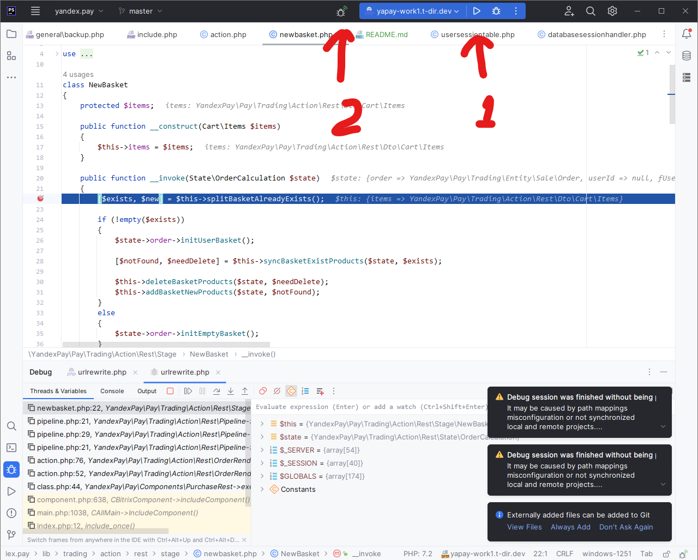

# Xdebug

Проблема: Яндекс отправляет запросы к нам со своего сервера, нужен get-параметр для старта отладки. 

Решение: `xdebug.start_with_request=yes`

## Настройка PhpStorm

[Следуйте документации](https://git.t-dir.com/support/techdir.stuff/-/tree/master/manuals/debug/xdebug#%D0%BD%D0%B0%D1%81%D1%82%D1%80%D0%BE%D0%B9%D0%BA%D0%B0), за исключением:
1. Настройте порт для отладки File -> Settings (скриншот ниже). И отметьте Can accept external connections;
2. В php.ini `xdebug.start_with_request=yes`
3. При настройке Debug Configurations в PhpStorm нужно замапить файлы публичной части (index.php и bitrix/urlrewrite.php).

php.ini
```
xdebug.mode=debug;
xdebug.client_port=9XXX;
xdebug.start_with_request=yes
```

## Старт отладки



Для начала отладки нажмите на Play и «жука с вайфаем». При запросе появится окно «External connections», скачайте публичный файл в проект и выберите настроенный Deployment.